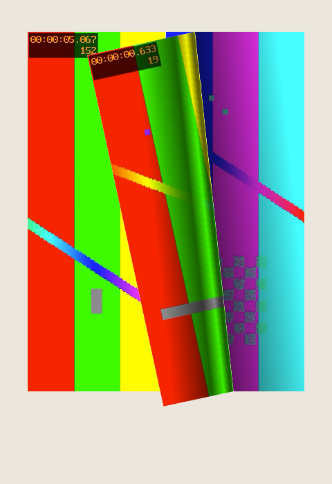

# Video pages — use cases and requirements (consumer request)

**From:** Puddlebend (picture-book house; ages 2–7 catalogue)
**To:** GulLabs flipbook maintainers (`@gullabs/flipbook-core`, `@gullabs/react-flipbook`)
**Date:** 2026-09-27
**Consumer pin today:** **3.2.1**
**Status:** requirements only. Nothing here is scheduled. The owner decides which use cases the library supports, which stay host-side recipes, and which are refused.

This document does three things:

1. Records, with a reproducible fixture, what 3.2.1 does today when a page contains a `<video>` (§1).
2. Catalogues every use case we could find for video inside a page-flip book — ours and those of other book, magazine and catalogue products — with the engine capability each one needs (§2).
3. Lists the cross-cutting requirements a clean, scalable implementation must satisfy, and the design options the owner can choose between (§3–§5).

It is written to the same bar as [PUDDLEBEND-REQUESTS.md](./PUDDLEBEND-REQUESTS.md): every ask carries why we need it, what happens if it is not supported, and the workaround today. Priority labels are ours, not the ship bar.

**Puddlebend's own position, stated up front so nobody schedules "Puddlebend needs video":** our current iOS reader phase excludes video by decision. Video pages are the next product line (animated adaptations of the existing books), and we want the engine question settled before that line starts, not during it. Only one item below is a defect in the shipped engine (§1.3); everything else is future capability.

---

## 0. Summary for the owner

| Finding                                                                                                                                                                                                       | Evidence                  | Consequence                                                                                                                        |
| ------------------------------------------------------------------------------------------------------------------------------------------------------------------------------------------------------------- | ------------------------- | ---------------------------------------------------------------------------------------------------------------------------------- |
| A `<video>` on an open page plays normally, in both spread and single-page modes.                                                                                                                             | §1.1                      | Nothing to do at rest.                                                                                                             |
| In **spread (landscape)** mode a turn folds the real leaf, so a playing video stays live through the curl.                                                                                                    | §1.2                      | Nothing to do for desk/tablet-landscape readers.                                                                                   |
| In **single-page (portrait)** mode the fold face is a `cloneNode(true)` copy. A cloned `<video>` is a **new player**: it re-requests the file, starts at 0, plays concurrently, and would play its own audio. | §1.3, screenshot          | Visible frame jump on every phone page turn of a video page; double download; double audio if unmuted. **This is the one defect.** |
| A drag that starts on a `<video controls>` starts a page turn.                                                                                                                                                | §1.4                      | Scrubbing the timeline turns the page.                                                                                             |
| Arrow keys on a focused `<video controls>` do **not** turn the page.                                                                                                                                          | §1.4                      | Already correct.                                                                                                                   |
| Hard pages never clone.                                                                                                                                                                                       | `Page.newTemporaryCopy()` | A "video leaves are hard" recipe avoids the defect with zero engine change, at the cost of the soft curl.                          |

The decisions we ask the owner to make are listed in §6. The shortest defensible path is: fix the clone (§5, option A), add `video[controls]`/`audio[controls]` to the interactive selector (option B), document a host-owned playback recipe (option D) — and refuse the rest until a consumer brings evidence.

---

## 1. What 3.2.1 does today — measured

Fixture: [`video-pages/fixture.html`](./video-pages/fixture.html) (six leaves: hard cover, text, a full-bleed `<video autoplay muted loop playsinline>`, a `<video controls>`, text, hard back). Probe: [`video-pages/probe.mjs`](./video-pages/probe.mjs), run with the repo's Playwright against Chromium and WebKit, `flippingTime: 2000`, measurements taken 700 ms into the turn. Test clips are generated, not committed:

```bash
ffmpeg -f lavfi -i "testsrc2=size=400x520:rate=30" -t 6 -c:v libx264 -pix_fmt yuv420p -an -movflags +faststart docs/requests/video-pages/silent.mp4
ffmpeg -f lavfi -i "testsrc2=size=400x520:rate=30" -f lavfi -i "sine=frequency=440" -t 6 -c:v libx264 -pix_fmt yuv420p -c:a aac -movflags +faststart docs/requests/video-pages/clip.mp4
```

`testsrc2` burns the timecode and frame counter into the picture, so a frame mismatch between the fold and the page beneath it is readable in a screenshot.

### 1.1 At rest

Both engines: the muted autoplay loop plays (`currentTime` advanced 0.56 → 1.36 s over 800 ms in Chromium, 0.45 → 1.25 s in WebKit). The `<video controls>` sits paused at its first frame. No engine involvement; the browser does everything, as ADR 0002 intends.

### 1.2 Spread (landscape) mid-turn

`[data-stf-clone]` count: **0** in both engines, forward and backward turns. The engine folds the real leaf (`Render.getFlippingPage` uses the actual left/right pages in landscape; `getPortraitFlippingPage` is the only clone caller). The original video kept playing (2.07 s mid-turn, 3.93 s after) and no additional `.mp4` request was made.

### 1.3 Single page (portrait) mid-turn — the defect

`[data-stf-clone]` count: **1**, containing a `<video>` with `autoplay`, `muted`, `readyState 4`, `currentTime 0.67 s` while the original was at **1.92 s**. Network log shows a **second request for `silent.mp4`** caused by the turn. Identical in Chromium and WebKit, forward and backward.



What a reader sees: the page they were watching jumps back to the start on the folding face, then jumps forward again when the turn settles. What the device pays: a second decoder and a second download for the length of the turn. What happens with an unmuted video (allowed after a user gesture): the copy inherits `autoplay` and plays its own audio track over the original's — two soundtracks for the length of the turn. We did not measure the unmuted case in the probe because headless engines refuse unmuted autoplay; the attribute copy is visible in the log and the behaviour follows from it.

This is a gap in the [LIVE-PAGE-FACES.md](../LIVE-PAGE-FACES.md) contract rather than a violation of it: that document promises the clone is a snapshot of attributes and text, and it is. A `<video>` element's _state_ (position, playback, decoded frame) is not an attribute, so the snapshot cannot carry it. Images, fonts and text have no such state; video, audio, `<canvas>` and CSS animations do (see §3.1 for the non-video cousins).

### 1.4 Input

- Pointer drag starting on `<video controls>`: engine state `user_fold`, i.e. the drag turns the page (screenshot: [`chromium-drag-on-controls.png`](./video-pages/chromium-drag-on-controls.png)). `FLIPBOOK_INTERACTIVE_SELECTOR` (`packages/core/src/interactive.ts`) lists form controls and ARIA widget roles; it does not list `video`, `audio`, `iframe`, `embed` or `object`.
- Keyboard: `ArrowRight` on a focused `<video controls>` left the page index unchanged. The binding's focus rule ("focus is the authority on who owns a key press") already covers replaced elements.

### 1.5 Not measured, stated from code

- Hard pages: `newTemporaryCopy()` returns `this`; no clone, so none of §1.3 applies.
- Reduced motion: `respectReducedMotion` makes the turn instant; no clone is drawn long enough to see. The video itself is unaffected — the engine does not know it is there.
- React binding `lazyRadius`: leaves outside the window are unmounted, which stops their decoders. Vanilla `PageFlip` has no window; every video leaf in the book holds a decoder unless the host unmounts it (PUDDLEBEND-REQUESTS PB-01).

---

## 2. Use cases

Legend for **Puddlebend priority** — _Need now_ / _Want soon_ / _When evidence_ / _Nice_ / _Not requested_, as defined in PUDDLEBEND-REQUESTS.md. **Others** names the product categories where we found the use case in the wild (§8 sources).

### UC-01 — Living illustration (silent loop in the illustration box)

|                      |                                                                                                                                                                                                                                                 |
| -------------------- | ----------------------------------------------------------------------------------------------------------------------------------------------------------------------------------------------------------------------------------------------- |
| **What**             | The illustration on an ordinary story page moves: rain on the window, the creek flowing, a character blinking. 2–8 s seamless loop, no audio track, fills exactly the illustration box; text is untouched. The page is otherwise a normal leaf. |
| **Media traits**     | `autoplay muted loop playsinline`, MP4/H.264 (+ optional HEVC/AV1 source), poster = the still illustration. Same still is the print/EPUB fallback.                                                                                              |
| **Engine needs**     | Fold fidelity (§3.1). Visibility-driven play/pause so off-screen loops do not decode (§3.2). Reduced-motion: show the poster, never the loop (§3.5). Full-bleed loop must still swipe — it has no controls.                                     |
| **Puddlebend**       | **Want soon** — the first thing the animated line will ship; the fold defect (§1.3) is the blocker on phones.                                                                                                                                   |
| **Others**           | Kindle in Motion (discontinued), Apple Books fixed-layout EPUB, Vooks-style animated storybooks.                                                                                                                                                |
| **If not supported** | Video leaves go hard (lose the soft curl on the pages that matter most), or stay stills on phones.                                                                                                                                              |

### UC-02 — Narrated page clip (video with audio, plays once)

|                      |                                                                                                                                                                                                                                                                                                                                                                      |
| -------------------- | -------------------------------------------------------------------------------------------------------------------------------------------------------------------------------------------------------------------------------------------------------------------------------------------------------------------------------------------------------------------- |
| **What**             | The read-aloud line's per-page clip — narration plus the living illustration — plays when the page arrives; the book waits, then turns itself or waits for the hand. The page's text is real HTML, not baked into the video.                                                                                                                                         |
| **Media traits**     | Audio essential; plays once; starts only after a user gesture unlocked audio (the "Read to me" tap); 5–40 s; must never be autoplayed by a clone.                                                                                                                                                                                                                    |
| **Engine needs**     | Everything in UC-01, plus: **the copy must not carry `autoplay`/play state** (double audio); the host must learn a turn is starting _before_ the clone exists so it can pause or freeze (§3.3, F06); hand-wins-over-voice semantics come from `changeState`, already sufficient. **No audio logic in core** — the host owns the clock (TRIAGED-BACKLOG PO-5, FB-X1). |
| **Puddlebend**       | **When evidence** — read-along v2+. Listed so the fold fix does not paint us into "muted only".                                                                                                                                                                                                                                                                      |
| **Others**           | Vooks, Nosy Crow animated picture books, Epic!-style readers.                                                                                                                                                                                                                                                                                                        |
| **If not supported** | Narrated video stays a separate "watch" surface (YouTube-style), not a page.                                                                                                                                                                                                                                                                                         |

### UC-03 — Animated cover

|                  |                                                                                                                 |
| ---------------- | --------------------------------------------------------------------------------------------------------------- |
| **What**         | The front cover breathes: a slow loop under the title. Covers are hard pages.                                   |
| **Media traits** | As UC-01.                                                                                                       |
| **Engine needs** | None new — hard pages never clone. Needs the host to pause the loop while the book is closed off-screen (§3.2). |
| **Puddlebend**   | **Nice**.                                                                                                       |
| **Others**       | Kindle in Motion animated covers.                                                                               |

### UC-04 — "Watch" page (full-bleed video with controls)

|                  |                                                                                                                                 |
| ---------------- | ------------------------------------------------------------------------------------------------------------------------------- |
| **What**         | A page whose whole content is a player: trailer, behind-the-scenes, a song. The reader taps play, can scrub, can go fullscreen. |
| **Media traits** | `controls`, audio, user-initiated, 30 s–several minutes; fullscreen on iPhone unless `playsinline`.                             |
| **Engine needs** | **Drag on controls must not fold** (§3.4). Fullscreen exit must not leave the engine mid-gesture. Pause on turn-away.           |
| **Puddlebend**   | **Not requested** in the reader; a possibility for the storefront's book pages.                                                 |
| **Others**       | FlippingBook, Flipsnack, Publuu, Heyzine, Paperturn — every commercial flipbook tool ships this as "inline video".              |

### UC-05 — Tap-to-play inset (magazine hotspot)

|                  |                                                                                                                                                                                                                        |
| ---------------- | ---------------------------------------------------------------------------------------------------------------------------------------------------------------------------------------------------------------------- |
| **What**         | A poster image with a play badge inside the page; tapping swaps in a player or opens a lightbox.                                                                                                                       |
| **Engine needs** | The tap must reach the host, not start a turn: `flipOnClick` policy vs a `[role=button]` hotspot (already respected). Lightbox over the book must suspend hover peel and keyboard turning (host concern; document it). |
| **Puddlebend**   | **Not requested**.                                                                                                                                                                                                     |
| **Others**       | Publuu, Paperturn, FlippingBook "popup" mode.                                                                                                                                                                          |

### UC-06 — Third-party embed (YouTube / Vimeo iframe)

|                  |                                                                                                                                                                                                                                                                                                                                                               |
| ---------------- | ------------------------------------------------------------------------------------------------------------------------------------------------------------------------------------------------------------------------------------------------------------------------------------------------------------------------------------------------------------- |
| **What**         | An `<iframe>` player inside the page.                                                                                                                                                                                                                                                                                                                         |
| **Engine needs** | Pointer events inside a cross-origin iframe never reach the engine, so drags cannot fold — but the engine's own pointer capture cannot _cancel_ a fold that started outside and crosses into the frame. Cloning an iframe reloads it (§1.3 applies, worse: a second embed, a second autoplay, analytics double-count). Should be in the interactive selector. |
| **Puddlebend**   | **Not requested** — no third-party frames in a children's product.                                                                                                                                                                                                                                                                                            |
| **Others**       | All commercial flipbook tools; the mobile caveat they all document is that hosted-player autoplay does not work on phones.                                                                                                                                                                                                                                    |

### UC-07 — Ambient background loop behind text

|                  |                                                                                                                                                                                                            |
| ---------------- | ---------------------------------------------------------------------------------------------------------------------------------------------------------------------------------------------------------- |
| **What**         | The loop is the page background; story text sits on top.                                                                                                                                                   |
| **Engine needs** | As UC-01, plus text over video must stay selectable/readable: the engine must not force a compositing arrangement that puts the video above the text during the fold (§3.6, WebKit clip-path/compositing). |
| **Puddlebend**   | **When evidence** — a variant of UC-01 we may or may not use.                                                                                                                                              |

### UC-08 — Sign-language / audio-description overlay

|                  |                                                                                                                                                                |
| ---------------- | -------------------------------------------------------------------------------------------------------------------------------------------------------------- |
| **What**         | A small persistent video (interpreter) pinned to the page corner or to the book chrome, in sync with narration.                                                |
| **Engine needs** | If it lives in the page it is UC-02 with two videos per leaf; if it lives in host chrome outside `.stf__block` the engine is uninvolved. **Recommend chrome.** |
| **Puddlebend**   | **Not requested** now; noted because accessibility asks arrive later and the answer should already be "chrome, not page".                                      |

### UC-09 — Motion panels (comics / sequential reveal)

|                  |                                                                                                                                                                                                                                 |
| ---------------- | ------------------------------------------------------------------------------------------------------------------------------------------------------------------------------------------------------------------------------- |
| **What**         | Several short clips on one page, triggered in order when the page arrives (panel 1 plays, then panel 2…).                                                                                                                       |
| **Engine needs** | A reliable "this leaf became visible / settled" signal (`flip` + `visiblePages` today) and "this leaf is leaving" (F06 or `changeState`). Multiple decoders per leaf — iOS limits on simultaneous playing videos matter (§3.7). |
| **Puddlebend**   | **Not requested**.                                                                                                                                                                                                              |
| **Others**       | Motion comics apps, Kindle in Motion.                                                                                                                                                                                           |

### UC-10 — Cinemagraph / Live-Photo crossfade

|                  |                                                                                                                                                                  |
| ---------------- | ---------------------------------------------------------------------------------------------------------------------------------------------------------------- |
| **What**         | A still that becomes a short loop on arrival, crossfading poster → video, and back to the still on leave.                                                        |
| **Engine needs** | As UC-01. The crossfade is host CSS; the engine only needs to not disturb `opacity` on the child (it does not — the leaf root is the only engine-owned element). |
| **Puddlebend**   | Variant of UC-01.                                                                                                                                                |

### UC-11 — Educational clip with captions

|                  |                                                                                                                                      |
| ---------------- | ------------------------------------------------------------------------------------------------------------------------------------ |
| **What**         | `<video>` with `<track kind="captions">`, transcript below.                                                                          |
| **Engine needs** | Caption rendering is the browser's; the clone would render its own (mismatched) captions — §3.1 covers it. Keyboard already correct. |
| **Puddlebend**   | **Not requested**.                                                                                                                   |
| **Others**       | Textbook and training flipbooks (FlippingBook's core market).                                                                        |

### UC-12 — Video pages in the accessible / sequential reading mode

|                  |                                                                                                                                                                            |
| ---------------- | -------------------------------------------------------------------------------------------------------------------------------------------------------------------------- |
| **What**         | Puddlebend's accessible mode renders the current leaf as normal-flow HTML outside the engine. A video leaf there is a plain `<video controls>` with poster and transcript. |
| **Engine needs** | None. Listed so "video page" is specified once for both renderings: same source, same poster, same alt/transcript.                                                         |
| **Puddlebend**   | Ours to build; **no engine ask**.                                                                                                                                          |

### UC-13 — Hover corner peel over a video page (desktop)

|                  |                                                                                                                                                                                                                                         |
| ---------------- | --------------------------------------------------------------------------------------------------------------------------------------------------------------------------------------------------------------------------------------- |
| **What**         | `foldCornerOnHover` lifts the corner of a video leaf on desktop.                                                                                                                                                                        |
| **Engine needs** | In spread mode no clone is made, so the peel shows the live video — fine. In single-page mode the peel clones (§1.3) on every hover: a network request per hover. **The clone fix must cover the peel path, not only committed turns.** |
| **Puddlebend**   | Web storefront reader uses hover peel; **Want soon** once UC-01 ships.                                                                                                                                                                  |

### UC-14 — Two videos on one spread (desk mode)

|                  |                                                                                                                                           |
| ---------------- | ----------------------------------------------------------------------------------------------------------------------------------------- |
| **What**         | Left and right leaves both animate.                                                                                                       |
| **Engine needs** | Nothing beyond UC-01; but the "pause what is not visible" rule must be per leaf, and both leaves count against the decoder budget (§3.7). |

### UC-15 — Video as the page-turn itself (pre-rendered turn animation)

|                  |                                                                                                                                             |
| ---------------- | ------------------------------------------------------------------------------------------------------------------------------------------- |
| **What**         | The turn is a rendered clip rather than a DOM fold.                                                                                         |
| **Engine needs** | This is canvas mode by another name. **Recommend refusing** (ADR 0002, FB-X5). Listed so it is refused explicitly rather than rediscovered. |

### UC-16 — Micro-animations that are not `<video>`

|                  |                                                                                                                                                                                                                                                                                                 |
| ---------------- | ----------------------------------------------------------------------------------------------------------------------------------------------------------------------------------------------------------------------------------------------------------------------------------------------- |
| **What**         | Lottie/SVG/CSS-animation sparkles, animated GIF/APNG/AVIF, `<canvas>` drawings. Not video, but the clone treats them the same way: CSS animations restart from their own clock in the copy (visible desync), `<canvas>` clones **blank** (bitmap is not an attribute), animated images restart. |
| **Engine needs** | Whatever fixes §1.3 should say what it does for `<canvas>` and CSS animations, even if the answer is "documented as unsupported".                                                                                                                                                               |
| **Puddlebend**   | **Nice** — we currently have no animated non-video content.                                                                                                                                                                                                                                     |

### UC-17 — 360° / spatial video, interactive video (branching)

Out of scope for a page-flip engine; noted as refused so the catalogue is complete.

---

## 3. Cross-cutting requirements

Numbered so the owner can accept or refuse each one independently.

### 3.1 Fold fidelity (the copy must show what the page shows)

- **R-1** During a turn or hover peel in single-page mode, the folding face of a video leaf shows the **same frame** the original was showing when the fold began (±1 frame). It does not restart, does not show the poster unless the original was showing the poster, and does not show a black box.
- **R-2** The copy causes **no additional network request** and **no additional decoder**. Measurable: zero `.mp4` requests attributable to a turn; at most one `HTMLMediaElement` per source in `document`.
- **R-3** The copy **never plays audio**. It must not inherit a live `autoplay`, and if it contains a media element at all that element is `muted` and paused.
- **R-4** The same guarantee holds for `<audio>` (no double playback), and the behaviour for `<canvas>`, `<iframe>` and CSS/SMIL animation is **specified** in LIVE-PAGE-FACES.md even if it is "restarts, unsupported".
- **R-5** The fix covers **every** clone path: committed turns, cancelled drags (snap-back), `foldCornerOnHover`, and `cancelTurn()`.

### 3.2 Playback lifecycle (who plays, who pauses)

- **R-6** A video on a leaf that is not in `visiblePages` should not be decoding. Whether the engine does this or the host does it from `flip`/`visiblePages` is the owner's call (§5, option D). Today the vanilla engine mounts every leaf; a 32-page book with a loop on each page holds 32 decoders.
- **R-7** Resume policy is a host decision (resume from where it was vs restart), so the engine must not reset `currentTime` or fire `load()` on anything it did not create.
- **R-8** Preload of the next/previous leaf's video is a host decision; the engine must not add `preload` attributes.
- **R-9** Nothing in core touches `HTMLMediaElement` playback of the **original** element. Core may touch only the elements it creates (clones). This keeps FB-X1 ("no audio in core") true.

### 3.3 Turn lifecycle signal

- **R-10** A host running UC-02 needs to know **before the clone is taken** that a turn is starting, so it can pause the original (freeze frame) and have the fold and the page agree. Today the earliest signal is `changeState: user_fold | flipping`, which fires **after** the clone exists. This is F06 / FB-C3, now with a concrete consumer reason. Alternative: the engine-side snapshot (option A) removes the need for the pre-clone signal for UC-01 but not for UC-02's audio pause.

### 3.4 Input

- **R-11** A pointer gesture that begins on `video[controls]`, `audio[controls]`, `iframe`, `embed`, `object` does **not** start a fold. Extend `FLIPBOOK_INTERACTIVE_SELECTOR`; behind `respectInteractiveContent` like the rest.
- **R-12** A `<video>` **without** controls remains a swipe surface (full-bleed loops must turn like paper).
- **R-13** Native fullscreen entry/exit on iPhone (no `playsinline`) must leave the engine in `read` with no pending gesture — cover it in the gesture e2e.
- **R-14** Keyboard: keep the current focus rule; add a test with a focused `<video controls>` so it stays covered.

### 3.5 Accessibility and reduced motion

- **R-15** Autoplaying video that runs longer than 5 s is WCAG 2.2.2 territory: a visible pause mechanism is required and `prefers-reduced-motion` alone does not satisfy it. The **host** provides the control; the library's job is to not break it (the clone is `inert` already — keep it) and to **document** the obligation next to any video recipe.
- **R-16** Under `prefers-reduced-motion: reduce` the recommended host behaviour is poster only, no autoplay. The engine's own `respectReducedMotion` should be documented as _not_ covering page content.
- **R-17** The clone stays `aria-hidden` + `inert`; a cloned `<track>` must not produce a second caption cue for screen readers.

### 3.6 Rendering

- **R-18** WebKit has a long-standing bug list around `clip-path` on replaced elements and around 3D transforms with composited descendants (`<video>` is always composited). The engine already keeps `clip-path` on the leaf root, not the video; the requirement is a **Playwright WebKit screenshot** of a video leaf mid-fold with no flicker/mis-clip, and a physical iOS check before any claim.
- **R-19** No per-frame style writes on the video element or its ancestors other than the leaf root (already the contract; add the video case to the "engine owns exactly" test).
- **R-20** Frame-time: a page turn with one playing 1080p loop under the fold must meet the same p95 rAF budget as a text page (FB-C1 fixture gets a video variant).

### 3.7 Platform constraints the spec must carry

- **R-21** iOS autoplay: only `muted` (or no audio track) + `playsinline` autoplays; a silent audio track does **not** count as muted. WKWebView additionally needs `allowsInlineMediaPlayback = true` and `mediaTypesRequiringUserActionForPlayback = []` in the host app. Document; not engine work.
- **R-22** iOS Low Power Mode blocks autoplay and shows a play glyph — the poster path must look intentional in that state.
- **R-23** Offline WKWebView editions serve media from local files; MP4 seeking needs HTTP range support from the scheme handler. Consumer concern; listed so the fixture includes a `Range`-capable server.
- **R-24** Decoder budget: iOS enforces practical limits on simultaneously decoding `<video>` elements and evicts under memory pressure. The spec must not assume "one video per leaf, all mounted" works; R-6 is the mitigation.

### 3.8 Content model (consumer side, for context)

Puddlebend's book contract has `Illustration { assetId, box, description }`. A living illustration would add an optional motion asset (`motionAssetId`, loop bounds, `poster` = the existing still) on the **same** illustration, not a new leaf kind — every existing book can gain motion without a schema break, and print/EPUB/accessible mode keep the still. This is our decision, not a library ask; it is here so the owner knows the engine will see `<video poster>` inside an ordinary leaf, not a special "video page" element.

---

## 4. Acceptance tests we would expect

1. **Fold parity (portrait):** fixture leaf with `testsrc2` timecode; screenshot at 35 % of `flippingTime`; the fold's burned-in frame counter is within 1 frame of the original's. Chromium + WebKit.
2. **No second request:** network log has exactly one request per media source across load + 3 turns + 3 hover peels.
3. **No second player:** `document.querySelectorAll('video').length` unchanged mid-turn, or the extra element is a `<canvas>`/`` marked `data-stf-clone`.
4. **No audio from the copy:** if a media element exists in the clone, `muted === true && paused === true`.
5. **Controls scrub does not fold:** drag on the timeline of `video[controls]` leaves state `read`.
6. **Full-bleed loop still swipes:** drag on a controls-less video reaches `user_fold`.
7. **Keyboard:** `ArrowRight` on a focused `video[controls]` does not change page index (regression guard for §1.4).
8. **Cancelled drag / snap-back:** parity holds and no request is made.
9. **Reduced motion:** with `respectReducedMotion` the turn is instant and no clone is observable; the host poster path is exercised in the example.
10. **Landscape unchanged:** spread turn with a playing video shows the live element (no clone) — pins today's correct behaviour.
11. **Frame budget:** FB-C1 fixture variant with a playing 1080p loop.

---

## 5. Design options for the owner

| Option                                                    | What changes                                                                                                                                                                                                                                                                                                               | Solves                           | Cost / risk                                                                                                                                                                                                                                                                      | Our view                                                        |
| --------------------------------------------------------- | -------------------------------------------------------------------------------------------------------------------------------------------------------------------------------------------------------------------------------------------------------------------------------------------------------------------------- | -------------------------------- | -------------------------------------------------------------------------------------------------------------------------------------------------------------------------------------------------------------------------------------------------------------------------------- | --------------------------------------------------------------- |
| **A. Engine snapshot in the clone**                       | `newTemporaryCopy()` walks the clone; for each `<video>` it replaces the cloned element with a `<canvas>` painted via `drawImage(originalVideo)` at the same box (`object-fit` honoured), or with the poster if the original has no frame yet. `<audio>` is stripped. Optional: same for `<canvas>` (`drawImage(canvas)`). | R-1…R-5, UC-01/03/07/10/13/14/16 | ~60 lines in `Page.ts`; cross-origin video without CORS headers taints the canvas but still **draws**, so display is unaffected. Frame is frozen for the turn (the original keeps playing beneath; parity is exact at clone time and drifts by ≤ `flippingTime`). No API change. | **Do first.** It is a fix to the copy's promise, not a feature. |
| **B. Interactive selector**                               | Add `video[controls]`, `audio[controls]`, `iframe`, `embed`, `object`.                                                                                                                                                                                                                                                     | R-11, UC-04/05/06/11             | One-line change + test; behaviour change for anyone relying on dragging over an iframe (unlikely). CHANGELOG entry.                                                                                                                                                              | **Do with A.**                                                  |
| **C. "Video leaves are hard" recipe**                     | Docs only: mark video leaves `data-density="hard"`.                                                                                                                                                                                                                                                                        | Avoids §1.3 without code         | Loses the soft curl on exactly the showpiece pages.                                                                                                                                                                                                                              | Document as the zero-code fallback; not the answer.             |
| **D. Host-owned playback recipe (+ optional React hook)** | Document: play when in `visiblePages`, pause otherwise, poster under reduced motion, WCAG pause control. Optionally ship `useFlipbookMedia()` in the React binding that does this for `[data-flipbook-media]` descendants.                                                                                                 | R-6…R-8, R-15/16, UC-01/02/09    | Hook is additive React surface (no core change). Keeps FB-X1.                                                                                                                                                                                                                    | Recipe now; hook when a second consumer asks.                   |
| **E. Pre-clone turn event (F06)**                         | `turnStarted { id, page, cause }` before `newTemporaryCopy()`, terminal event with the same id.                                                                                                                                                                                                                            | R-10, UC-02                      | Locked-surface amendment + ADR. Already on the backlog as FB-C3 with this exact gate.                                                                                                                                                                                            | Defer until UC-02 is authorised; A removes the need for UC-01.  |
| **F. Engine-managed media (play/pause in core)**          | Core drives `HTMLMediaElement` on leaf visibility.                                                                                                                                                                                                                                                                         | R-6 without a host               | Violates FB-X1 / PO-5; drags audio policy, autoplay promises and platform quirks into the engine.                                                                                                                                                                                | **Refuse.**                                                     |
| **G. Do nothing, document**                               | LIVE-PAGE-FACES gains a "media elements restart in the copy" line.                                                                                                                                                                                                                                                         | Honesty                          | Every phone reader with video pages shows the jump.                                                                                                                                                                                                                              | Acceptable only if video pages are refused as a supported use.  |

Ordering we would choose: **A + B** as a 3.2.x patch with tests 1–8 and 10; **D** as docs in the same release; **E** when read-along authorises UC-02; **C** and **G** as documented fallbacks.

---

## 6. Decisions requested from the owner

1. Is a `<video>` inside a soft leaf a **supported** content type (fix §1.3), or a **documented limitation** (option G)?
2. If supported: engine snapshot (A) or pre-clone event so the host freezes it (E)? A needs no API; E needs the amendment. Both can coexist.
3. Does the snapshot also cover `<canvas>` and `<audio>`? (We recommend yes for audio-strip, yes for canvas since it is the same `drawImage`.)
4. Interactive selector additions (B): accept `video[controls]`, `audio[controls]`, `iframe`, `embed`, `object`?
5. Playback lifecycle: docs recipe only, or also a React hook? Core stays out either way.
6. Where does the video fixture live — `examples/mobile-reader` (gains a video leaf) or a new `fixtures/video-pages`?

---

## 7. Not requested by Puddlebend

- Audio mixing, narration clocks, cue timing, auto-turn in core (FB-X1 stands).
- Managing third-party players or iframes beyond not folding on them.
- Video-textured page turns, WebGL, canvas mode (ADR 0002).
- Any engine knowledge of _what_ the video is (poster selection, source selection, captions). The host authors the `<video>`; the engine copies it faithfully or not at all.

---

## 8. Sources

Engine: `packages/core/src/Page/Page.ts` (`newTemporaryCopy`, `data-stf-clone`), `packages/core/src/Collection/flippingPage.ts` (portrait-only cloning), `packages/core/src/interactive.ts`, `packages/react/src/HTMLFlipBook.tsx` keyboard rule; [LIVE-PAGE-FACES.md](../LIVE-PAGE-FACES.md), [KNOWN-LIMITATIONS.md](../KNOWN-LIMITATIONS.md), [ADR 0002](../adr/0002-remove-canvas-mode.md), [TRIAGED-BACKLOG.md](../TRIAGED-BACKLOG.md) (PO-5, FB-C3, FB-X1/X5).

Platform and standards:

- WebKit, [New `<video>` policies for iOS](https://webkit.org/blog/6784/new-video-policies-for-ios/) — muted/no-audio-track autoplay, `playsinline`.
- Thomas Visser, [Autoplaying video in WKWebView](https://www.thomasvisser.me/2018/06/26/wkwebview-media/) — `mediaTypesRequiringUserActionForPlayback`, `allowsInlineMediaPlayback`.
- Bitmovin, [Autoplay policies for Safari and Chrome](https://bitmovin.com/blog/autoplay-policies-safari-14-chrome-64/) — silent audio track is not "muted"; play() promise is the only detection.
- Apple Developer Forums, [Muted video play: NotAllowedError](https://developer.apple.com/forums/thread/727855) and [Low Power Mode autoplay](https://developer.apple.com/forums/thread/709821).
- WebKit Bugzilla, [Make clip-path work on `<video>`, `<canvas>` etc.](https://bugs.webkit.org/show_bug.cgi?id=138684); WebKit commit note on [clip-path + composited descendants](https://github.com/WebKit/WebKit/commit/89c201dc66002469942d6af54a5912ed174db28d).
- W3C, [WCAG 2.2.2 Pause, Stop, Hide](https://wcag.dock.codes/documentation/wcag222/) and the open question whether `prefers-reduced-motion` satisfies it ([w3c/wcag#3766](https://github.com/w3c/wcag/issues/3766)); thoughtbot, [Can auto-playing videos be accessible?](https://thoughtbot.com/blog/can-auto-playing-videos-be-accessible).
- Apple, [Books Asset Guide — EPUB 3 fixed layout](https://help.apple.com/itc/booksassetguide/en.lproj/itcef2bad6b8.html) — video in fixed-layout picture books.

Products with video pages (for the use-case catalogue):

- [FlippingBook — videos in depth](https://flippingbook.com/help/online/changing-your-publication/video-in-depth) (inline vs popup, autoplay desktop-only for hosted players, muted on first page).
- [Flipsnack — adding videos](https://help.flipsnack.com/en/articles/1994877-adding-music-and-videos-to-a-flipbook) (autoplay-on-arrive, forced mute on mobile).
- [Publuu — add videos](https://publuu.com/help/how-to-add-videos/) (hotspot vs embedded player; YouTube/Vimeo only).
- [Paperturn — embed video](https://www.paperturn.com/pdf-flip-book-guide/youtube-vimeo-video) (mobile always popup; no autoplay).
- [Heyzine](https://heyzine.com/) (video, audio, embeds as page widgets).
- [Ebook Friendly — What is Kindle in Motion?](https://ebookfriendly.com/what-is-kindle-in-motion/) (animated covers, loops, custom backgrounds; discontinued for new titles).
- [Vooks](https://www.vooks.com/) (animated read-aloud storybooks with highlighted text); Common Sense Media on [Nosy Crow's Cinderella](https://www.commonsensemedia.org/app-reviews/cinderella-nosy-crow-animated-picture-book-for-iphone).
